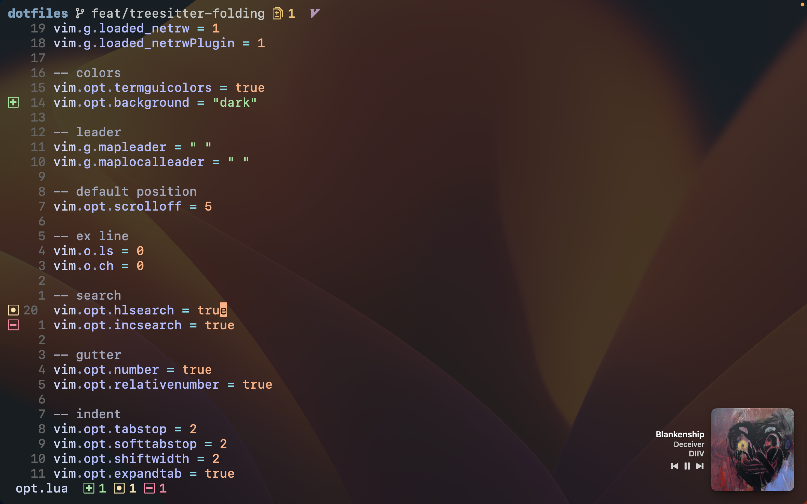

# Jackson Hoffart's Dotfiles

Forked from https://github.com/joshmedeski/dotfiles 

This is the home of all my dotfiles. These are files that add custom configurations to my computer and applications, primarily the terminal.

# Software

- Terminal: [WezTerm](https://wezfurlong.org/wezterm/)
- Font: [SFMono Nerd Font](https://github.com/epk/SF-Mono-Nerd-Font)
- Colors: [catppuccin](https://github.com/catppuccin/catppuccin)
- Shell: [fish](https://fishshell.com)
- Multiplexer: [tmux](https://github.com/tmux/tmux/wiki)
- Editor: [Neovim](https://neovim.io)
- Docker: [lazydocker](https://github.com/jesseduffield/lazydocker)
- Git: [lazygit](https://github.com/jesseduffield/lazygit)
- macOS package manager: [Homebrew](https://brew.sh)
- npm package manager: [pnpm](https://pnpm.io/)
- music accessory: [Sleeve](https://replay.software/sleeve)

# Hardware

- Laptop: [MacBook Pro] (13-inch, 2020, Apple M1 Pro Chip, 16GB RAM)
- Keyboard: [Razer Blackwidow Lite](https://www.razer.com/gaming-keyboards/razer-blackwidow-lite)
- Mouse: [CMStorm Recon](https://www.coolermaster.com/us/en-us/catalog/legacy-products/peripheral/recon/)
